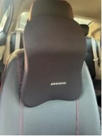
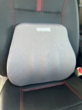
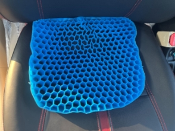

# Rediscover Comfort: Essential Accessories for Your Car Journey

Driving is more than just getting from Point A to Point B; it’s an experience, a moment of solitude, or quality time with family. But let’s face it—those hours behind the wheel can be taxing on your body. That’s why we at **Awesome Car Accessories** has bought in a line of products to make your drives not just bearable but blissfully comfortable.

Our **Neck Rest**, **Back Rest**, and **Silicone Car Seat Cushion** have been recommended by multiple orthopedic specialists for their ability to provide exceptional support for your neck, back, waist, and hips. These products ensure better posture, reduce strain, and elevate your overall driving experience.

|  |  |  |
|-------------------------------------------------------------------------------------|-----------------------------------------------------------------------------------|--------------------------------------------------------------------------------------------------|
| **Neck Rest**                                                                       | **Back Rest**                                                                     | **Silicone Car Seat Cushion**                                                                   |

-----
**Why Comfort Matters on the Road**

Ever finished a drive feeling stiff, sore, or completely drained? You’re not alone. Poorly designed car seats can lead to:

- Neck pain and stiffness.
- Lower back discomfort.
- Fatigue due to uneven weight distribution.

Our doctor-recommended accessories address these pain points, helping you enjoy every mile with ease.

-----
**1. Neck Rest: Say Goodbye to Stiffness**

Your neck deserves better than awkward angles and painful stiffness. Our **Neck Rest** provides ergonomic support to keep your neck aligned during drives.

**Orthopedic Benefits:**

- **Relieves Pressure:** Prevents strain by supporting the natural curve of your neck.
- **Encourages Healthy Posture:** Reduces the risk of long-term issues like cervical pain.

**Features That Resonate with Drivers:**

- **Memory Foam Core:** Adapts to your neck’s unique shape for unparalleled comfort.
- **Breathable Fabric:** Keeps you cool even on warm days.
- **Easy Installation:** Adjustable straps fit any car seat.
-----
**2. Back Rest: A Support System for Your Spine**

Sitting for hours can wreak havoc on your back, especially without lumbar support. Recommended by specialists for promoting spinal health, our **Back Rest** keeps your spine in its natural alignment, reducing discomfort.

**Orthopedic Benefits:**

- **Targeted Lumbar Support:** Reduces lower back pain and promotes healthy posture.
- **Even Pressure Distribution:** Prevents fatigue during long drives.

**Key Features:**

- Durable materials that maintain firmness and comfort.
- Adjustable straps for a perfect fit.
-----
**3. Silicone Car Seat Cushion: Comfort Beyond Comparison**

More than just a cushion, this product offers comprehensive support for your hips and lower body. It’s been designed with input from orthopedic specialists to ensure optimal comfort for your waist and hips.

**Orthopedic Benefits:**

- **Weight Distribution:** Relieves pressure on your lower body and prevents soreness.
- **Shock Absorption:** Protects your hips and lower back from road impacts.

**Key Features:**

- Non-slip design for stability.
- Multipurpose use—perfect for office chairs or dining seats too.
-----
**Why These Accessories Are a Must-Have**

Recommended by professionals, these products go beyond comfort. They actively improve your posture, reduce long-term strain, and prevent aches and pains caused by prolonged sitting. Whether you're commuting to work or heading out on a road trip, these accessories are designed with your health and well-being in mind.

-----
**Valuable Insights for Our Target Audience**

We understand the needs of modern drivers, which is why these products are:

1. **Backed by Specialists:** Trusted by orthopedic experts for their ergonomic design.
1. **Easy to Use:** Quick installation and universal compatibility.
1. **Stylish and Functional:** Complements your car’s interior while delivering exceptional support.
-----
**Drive Smarter, Drive Healthier**

Your health and comfort shouldn’t take a back seat. Our **Neck Rest**, **Back Rest**, and **Silicone Car Seat Cushion** aren’t just accessories—they’re essential tools for a pain-free and enjoyable drive.

Head over to **Awesome Car Accessories** now to shop for products trusted by professionals and loved by drivers. Turn every trip into a journey of wellness and relaxation.

-----
**Shop today and experience doctor-approved comfort for every mile. Because you deserve more than just a ride—you deserve health and happiness on the road.**

